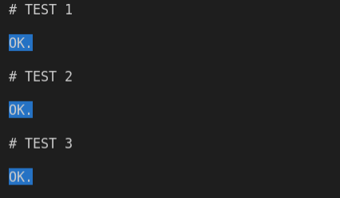

# Soluções de Problemas do Site URI Online Judge

Soluções para problemas de computação do site de competições URI Online Judge. Cada problema tem sua implementação e testes armazenados no diretório `problemas` deste repositório.

## Problemas Solucionados

Lista de problemas que foram solucionados:

| Problema URI                                                                         | Linguagem Utilizada | Diretório da Solução     |
|----------------------------------------------------------------------------------    |---------------------| ---------------------    |
| [URI 1310 Profit](https://www.urionlinejudge.com.br/judge/en/problems/view/1310)     | C++17               | problemas/1310_profit    |
| [URI 1487 Six Flags](https://www.urionlinejudge.com.br/judge/en/problems/view/1487)  | C++17               | problemas/1487_six_flags |
| [URI 2242 Go--](https://www.urionlinejudge.com.br/judge/en/problems/view/2241)       | C++17               | problemas/2241_go        |
| [URI 2664 Ginástica](https://www.urionlinejudge.com.br/judge/en/problems/view/2241)  | C++17               | problemas/2664_gymnastics|


## Pré-requisitos

Todos códigos foram criados e executados no sistema operacional Ubuntu 18.04 (Linux). 

* Códigos em C++ estão na versão C++17.

## Compilando e Executando Testes

Cada solução está no diretório `problemas` onde há um Makefile para compilação e um Bash Script para execução dos testes.

Vamos pegar como exemplo o desafio `problemas/1310_profit`. Para compilar o programa basta executar os seguint  es passos no seu terminal:

```bash
cd problemas/1310_profit
make
```

Com isso será gerado uma arquivo binário: `bin/main`. Agora para executar os testes basta executar os comandos:

```bash
cd test/
bash execution.sh
```

O bash executa o programa para cada input em `test/input` e gera uma saída no diretório `test/output` para cada caso. Quando um teste passou será enviado ao terminal um sinal de 'OK.' enquanto uma falha será representada pelo final de 'FAIL!'. 

A seguir é mostrado a saída quando executamos os testes para o problema `1310_profit`:




## Ferramentas Utilizadas

* [Visual Studio Code](https://code.visualstudio.com/) - Editor usado para implementações e testes.

## Autores

* **Christian Gomes** - *Criador* - [christianrfg](https://github.com/christianrfg)

Olhe também a lista de [contribuidores](https://github.com/christianrfg/solucoes_uri/contributors) que participarem desse projeto.

## Licença

Este projeto está licenciado sob a Licença MIT - consulte o arquivo [LICENSE.md](LICENSE.md) para mais detalhes.

